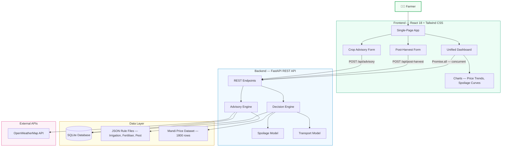

# AgriTech — System Architecture

A dual-engine agricultural decision support system combining crop growth advisories with post-harvest loss minimization.

---

## High-Level Architecture

---

## Component Summary

| Layer | Technology | Purpose |
|-------|-----------|---------|
| **Frontend** | React 18, Vite 5, Tailwind CSS, Recharts | Single-page UI with forms, dashboard, charts |
| **Backend** | FastAPI, Pydantic, SQLAlchemy 2.0 | REST API with validation and ORM |
| **Database** | SQLite | Session logging, location/crop metadata |
| **Rule Engine** | JSON files + Python logic | Crop-stage advisory generation |
| **Decision Engine** | Python + CSV data | Post-harvest profit optimization |
| **External** | OpenWeatherMap | Live weather data for risk multipliers |

---

## API Endpoints

| Method | Endpoint | Description |
|--------|----------|-------------|
| `GET` | `/api/health` | System health check |
| `GET` | `/api/locations` | Available farm locations |
| `GET` | `/api/crops` | Supported crop profiles |
| `GET` | `/api/rules` | Merged crop stage rules |
| `POST` | `/api/advisory` | Generate crop advisories |
| `POST` | `/api/post-harvest` | Generate post-harvest plan |
| `POST` | `/api/leaf-classify` | Classify leaf disease from image |

---

*— Phase 0 Submission —*
