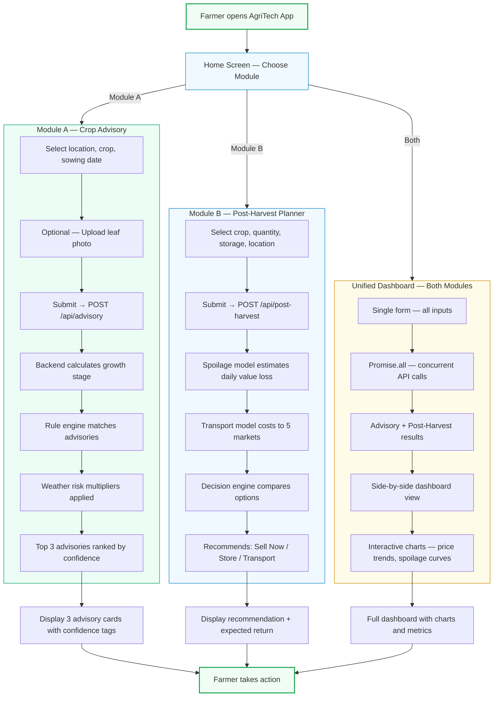

# User Flows

## Primary User Journey

---

## Flow Descriptions

### Module A — Crop Advisory
Farmer selects location, crop, and sowing date. The system calculates the current growth stage, applies weather risk multipliers, and returns the top 3 prioritized advisories (irrigation, fertiliser, pest control) with confidence scores.

### Module B — Post-Harvest Planner
Farmer selects crop, quantity, storage condition, and location. The system estimates daily spoilage costs, calculates transport expenses to nearby markets, and recommends the option with the highest net return.

### Unified Dashboard
Single form triggers both modules concurrently. Results display side-by-side with interactive charts showing 90-day price trends and 30-day spoilage curves.

---

*— Phase 0 Submission —*
