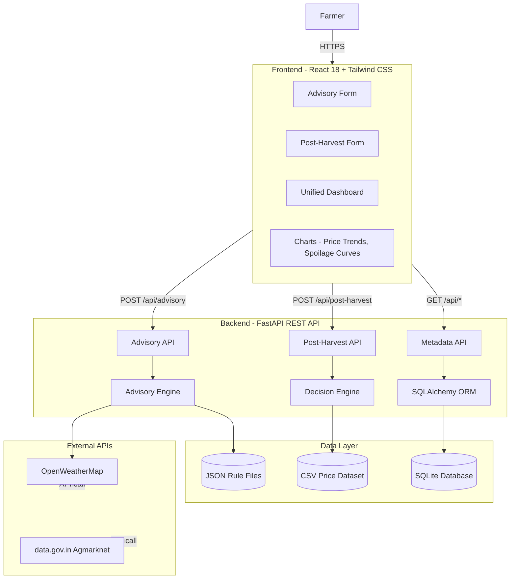
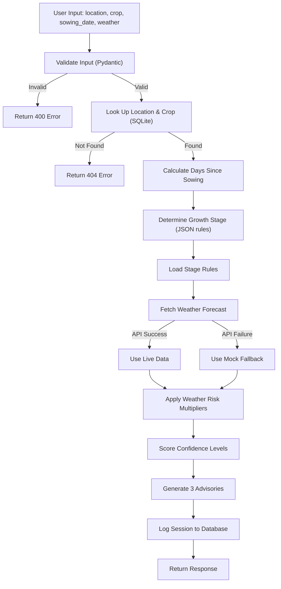
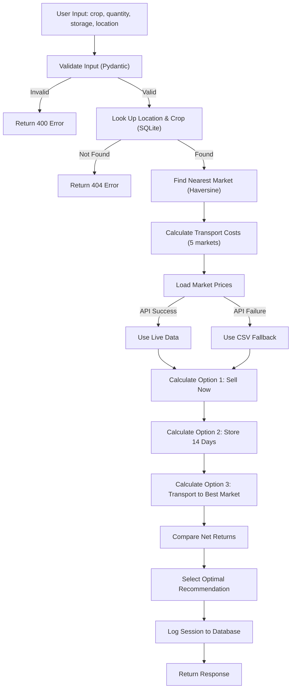
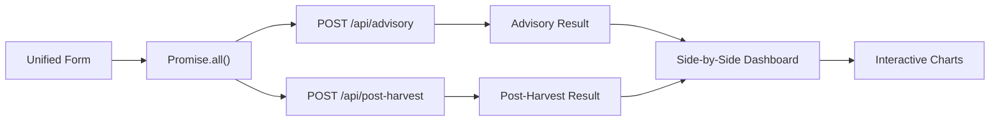
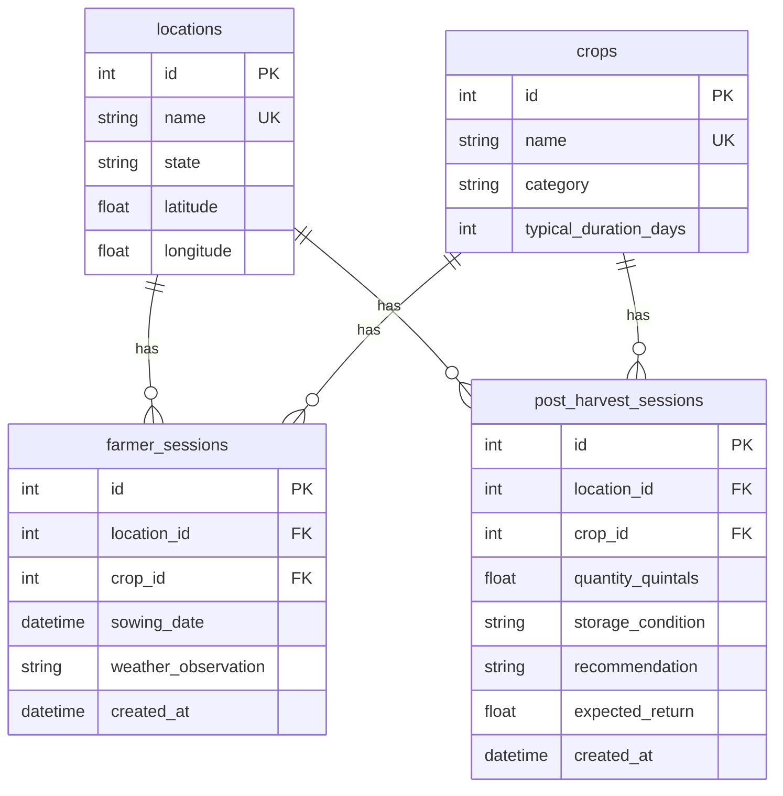
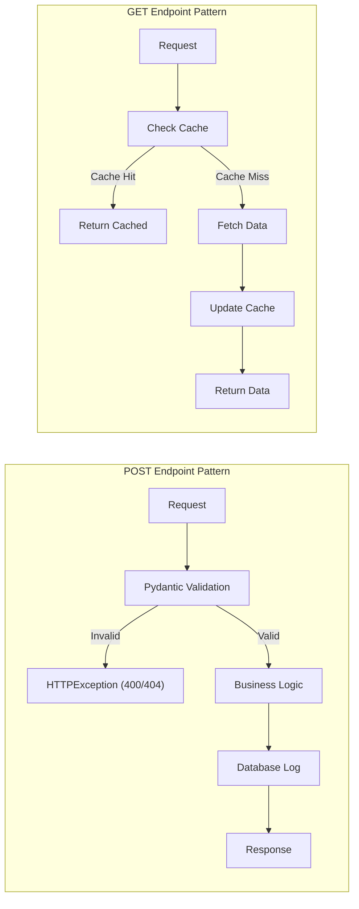
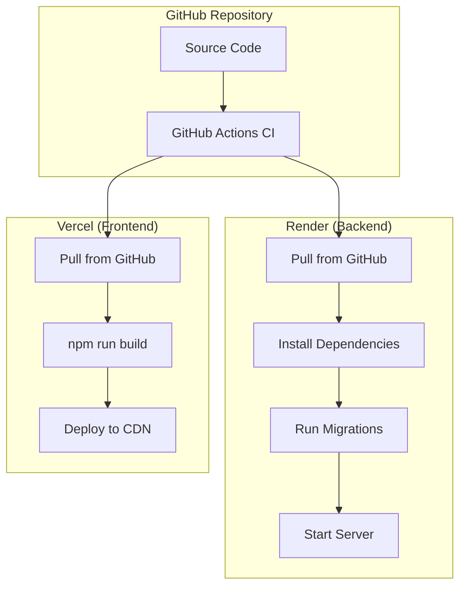
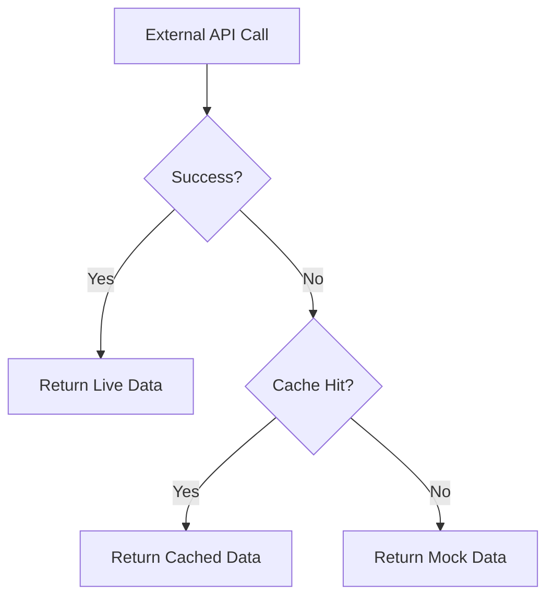
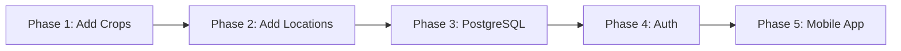

# Software Requirements Document (SRD)

**Project:** AgriTech - Precision Crop Advisory & Post-Harvest Decision Engine  
**Version:** 1.0  
**Date:** July 2026  
**Team:** TetraTHON 2026  

---

## Table of Contents

1. [Introduction](#1-introduction)
2. [System Architecture](#2-system-architecture)
3. [Design Decisions](#3-design-decisions)
4. [Data Flow](#4-data-flow)
5. [Database Design](#5-database-design)
6. [API Design](#6-api-design)
7. [Security Design](#7-security-design)
8. [Deployment Design](#8-deployment-design)
9. [Error Handling Strategy](#9-error-handling-strategy)
10. [Future Considerations](#10-future-considerations)

---

## 1. Introduction

### 1.1 Purpose

This Software Requirements Document (SRD) describes the technical design and architecture of the AgriTech platform. It documents the rationale behind technology choices, system design, and implementation patterns.

### 1.2 Scope

This document covers:
- System architecture and component design
- Technology selection rationale
- Data flow and processing logic
- Database schema design
- API endpoint design
- Security and deployment architecture

---

## 2. System Architecture

### 2.1 High-Level Architecture



### 2.2 Component Responsibilities

| Component | Responsibility | Technology |
|-----------|---------------|------------|
| Frontend | User interface, form handling, chart rendering | React 18, Vite, Tailwind, Recharts |
| Backend API | Request routing, validation, response formatting | FastAPI, Pydantic |
| Advisory Engine | Growth stage calculation, rule matching, weather integration | Python, JSON rules |
| Decision Engine | Spoilage modeling, transport costing, financial comparison | Python, CSV data |
| Database | Session logging, metadata storage | SQLite, SQLAlchemy ORM |
| External APIs | Weather forecasts, market prices | OpenWeatherMap, data.gov.in |

---

## 3. Design Decisions

### 3.1 FastAPI Over Flask

| Criterion | FastAPI | Flask | Decision |
|-----------|---------|-------|----------|
| Async support | Native | Requires extensions | FastAPI |
| Auto-generated docs | Built-in (Swagger) | Manual | FastAPI |
| Request validation | Pydantic built-in | Manual | FastAPI |
| Performance | High (Starlette) | Medium | FastAPI |
| Learning curve | Medium | Low | Flask |

**Decision:** FastAPI chosen for built-in validation, async support, and auto-documentation. The 36-hour timeline makes these built-in features critical.

### 3.2 SQLite Over PostgreSQL

| Criterion | SQLite | PostgreSQL | Decision |
|-----------|--------|------------|----------|
| Setup time | Zero | Minutes | SQLite |
| Portability | Single file | Server required | SQLite |
| ACID compliance | Yes | Yes | Tie |
| Concurrent writes | Limited | Excellent | PostgreSQL |
| Scalability | Limited | Excellent | PostgreSQL |

**Decision:** SQLite chosen for zero-setup, portability, and crash safety. Acceptable for prototype scale (5 locations, 4 crops). Migration path to PostgreSQL is straightforward for production.

### 3.3 Tailwind CSS Over Component Libraries

| Criterion | Tailwind | MUI/Chakra | Decision |
|-----------|----------|------------|----------|
| Bundle size | ~3KB | ~200KB | Tailwind |
| Customization | Full control | Theme-based | Tailwind |
| Learning curve | Medium | Low | Tie |
| Design consistency | Manual | Built-in | MUI |

**Decision:** Tailwind chosen for minimal bundle size and full design control. With 14 components, custom styling is faster than learning and customizing a library.

### 3.4 State-Based Routing Over React Router

| Criterion | State Variable | React Router | Decision |
|-----------|---------------|--------------|----------|
| Setup time | Zero | Configuration | State |
| URL management | None | Deep linking | React Router |
| Bundle size | Zero | ~15KB | State |
| Complexity | Low | Medium | State |

**Decision:** State-based routing chosen for simplicity. Deep linking is unnecessary for a single-page hackathon demo.

### 3.5 Mock Fallback Strategy

**Problem:** External APIs (OpenWeatherMap, Agmarknet) may fail during demo.

**Solution:** Every external API call has a deterministic mock fallback:
- Weather: Location-specific mock forecasts
- Prices: CSV dataset with 1,800+ historical records

**Benefit:** Demo never fails. System works offline.

---

## 4. Data Flow

### 4.1 Crop Advisory Flow



### 4.2 Post-Harvest Decision Flow



### 4.3 Unified Dashboard Flow



---

## 5. Database Design

### 5.1 Entity Relationship Diagram



### 5.2 Table Definitions

#### locations

| Column | Type | Constraints | Description |
|--------|------|-------------|-------------|
| id | INTEGER | PRIMARY KEY | Unique identifier |
| name | VARCHAR | UNIQUE, NOT NULL | City name |
| state | VARCHAR | NOT NULL | State name |
| latitude | FLOAT | NOT NULL | Geographic latitude |
| longitude | FLOAT | NOT NULL | Geographic longitude |

#### crops

| Column | Type | Constraints | Description |
|--------|------|-------------|-------------|
| id | INTEGER | PRIMARY KEY | Unique identifier |
| name | VARCHAR | UNIQUE, NOT NULL | Crop name |
| category | VARCHAR | NOT NULL | cash_crop / cereal / vegetable |
| typical_duration_days | INTEGER | NOT NULL | Growth period in days |

#### farmer_sessions

| Column | Type | Constraints | Description |
|--------|------|-------------|-------------|
| id | INTEGER | PRIMARY KEY | Unique identifier |
| location_id | INTEGER | FK → locations.id | Requested location |
| crop_id | INTEGER | FK → crops.id | Requested crop |
| sowing_date | DATETIME | NULLABLE | Farmer-provided date |
| weather_observation | VARCHAR | NULLABLE | Weather condition |
| created_at | DATETIME | DEFAULT NOW() | Request timestamp |

#### post_harvest_sessions

| Column | Type | Constraints | Description |
|--------|------|-------------|-------------|
| id | INTEGER | PRIMARY KEY | Unique identifier |
| location_id | INTEGER | FK → locations.id | Requested location |
| crop_id | INTEGER | FK → crops.id | Requested crop |
| quantity_quintals | FLOAT | NOT NULL | Quantity input |
| storage_condition | VARCHAR | NOT NULL | Storage type |
| recommendation | VARCHAR | NOT NULL | System recommendation |
| expected_return | FLOAT | NOT NULL | Expected net return |
| created_at | DATETIME | DEFAULT NOW() | Request timestamp |

---

## 6. API Design

### 6.1 Endpoint Overview

| Method | Endpoint | Purpose | Rate Limit |
|--------|----------|---------|------------|
| GET | /api/health | System health check | Unlimited |
| GET | /api/locations | List available locations | Unlimited |
| GET | /api/crops | List supported crops | Unlimited |
| GET | /api/rules | Get merged crop rules | Unlimited |
| POST | /api/advisory | Generate crop advisories | 30/min |
| POST | /api/post-harvest | Generate post-harvest plan | 30/min |
| GET | /api/price-history | Get price trend data | 30/min |
| GET | /api/spoilage-curve | Get spoilage projection | 30/min |
| POST | /api/leaf-classify | Classify leaf image | 30/min |

### 6.2 Request/Response Patterns



### 6.3 Error Response Format

```json
{
  "detail": "Human-readable error message"
}
```

| Status Code | Meaning |
|-------------|---------|
| 200 | Success |
| 400 | Bad request (validation failed) |
| 404 | Resource not found |
| 429 | Rate limit exceeded |
| 500 | Internal server error |

---

## 7. Security Design

### 7.1 Rate Limiting

| Implementation | slowapi middleware |
|----------------|-------------------|
| Limit | 30 requests/minute per endpoint |
| Scope | Per IP address |
| Response | 429 Too Many Requests |

### 7.2 CORS Configuration

```python
origins = ["http://localhost:5173"]  # Development
# Production: specific domain from environment variable
```

### 7.3 Security Headers

| Header | Value | Purpose |
|--------|-------|---------|
| X-Content-Type-Options | nosniff | Prevent MIME sniffing |
| X-Frame-Options | DENY | Prevent clickjacking |
| X-XSS-Protection | 1; mode=block | XSS protection |
| Referrer-Policy | strict-origin-when-cross-origin | Control referrer |

### 7.4 Input Validation

- All inputs validated via Pydantic schemas
- SQL injection prevented by SQLAlchemy ORM
- File uploads validated by type and size

---

## 8. Deployment Design

### 8.1 Deployment Architecture



### 8.2 Environment Variables

| Variable | Purpose | Required |
|----------|---------|----------|
| AUTO_SEED | Auto-populate database | Yes |
| OPENWEATHER_API_KEY | Weather API access | No (mock fallback) |
| AGMARKNET_API_KEY | Market price API access | No (CSV fallback) |
| CORS_ORIGINS | Allowed frontend domains | Yes |

### 8.3 Build Commands

**Backend:**
```bash
pip install -r requirements.txt
uvicorn App.main:app --host 0.0.0.0 --port $PORT
```

**Frontend:**
```bash
npm install
npm run build
```

---

## 9. Error Handling Strategy

### 9.1 Error Categories

| Category | Example | Handling |
|----------|---------|----------|
| Validation Error | Invalid date format | 400 + descriptive message |
| Not Found | Unknown crop name | 404 + resource name |
| External API Failure | Weather API timeout | Mock fallback |
| Business Logic Error | Zero quantity | 400 + validation message |
| System Error | Database connection | 500 + logged error |

### 9.2 Fallback Chain



### 9.3 Global Exception Handler

```python
@app.exception_handler(Exception)
async def global_exception_handler(request, exc):
    return JSONResponse(
        status_code=500,
        content={"detail": f"Internal server error: {str(exc)}"}
    )
```

---

## 10. Future Considerations

### 10.1 Scalability Path



| Phase | Change | Effort |
|-------|--------|--------|
| Phase 1 | Add more crops (10+) | Data addition |
| Phase 2 | Add more locations (50+) | Data addition |
| Phase 3 | PostgreSQL migration | Connection string change |
| Phase 4 | User authentication | Add auth middleware |
| Phase 5 | Mobile app (React Native) | Reuse API layer |

### 10.2 Technical Debt

| Item | Priority | Effort |
|------|----------|--------|
| Add database migrations (Alembic) | High | 2 hours |
| Add structured logging | Medium | 2 hours |
| Add API versioning (/v1/) | Low | 1 hour |
| Add TypeScript to frontend | Low | 8 hours |
| Add E2E tests | Medium | 4 hours |

### 10.3 Potential Enhancements

| Enhancement | Value |
|-------------|-------|
| Multi-language support (Hindi, Gujarati) | Wider reach |
| SMS advisory delivery | Offline access |
| Offline mode (PWA) | No internet required |
| Machine learning yield prediction | Higher accuracy |
| Satellite imagery integration | Remote sensing |

---

*- AgriTech SRD v1.0 -*
