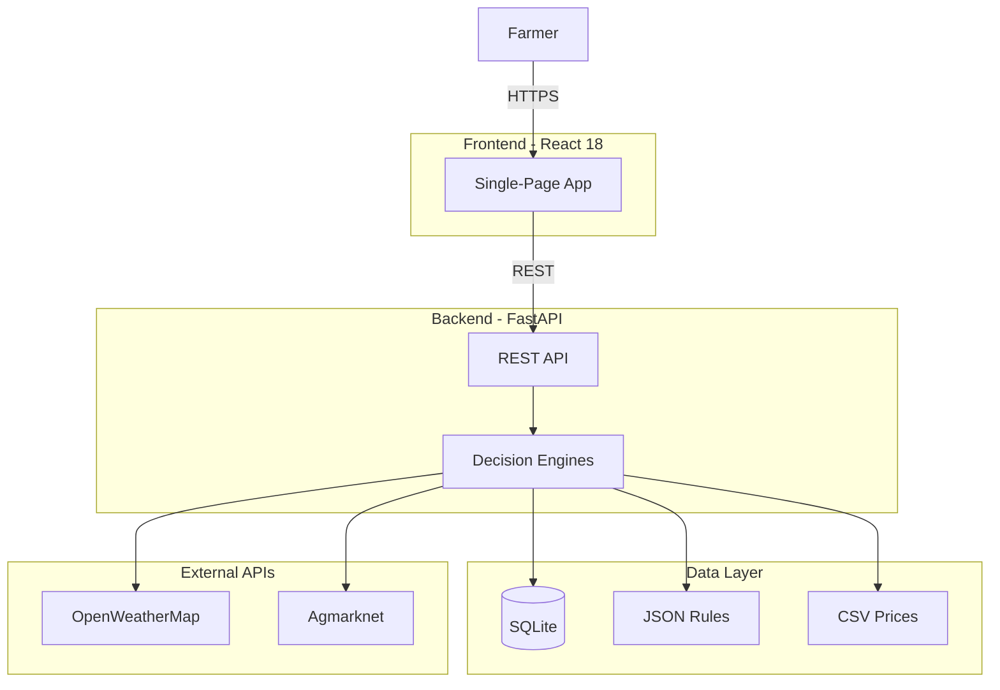
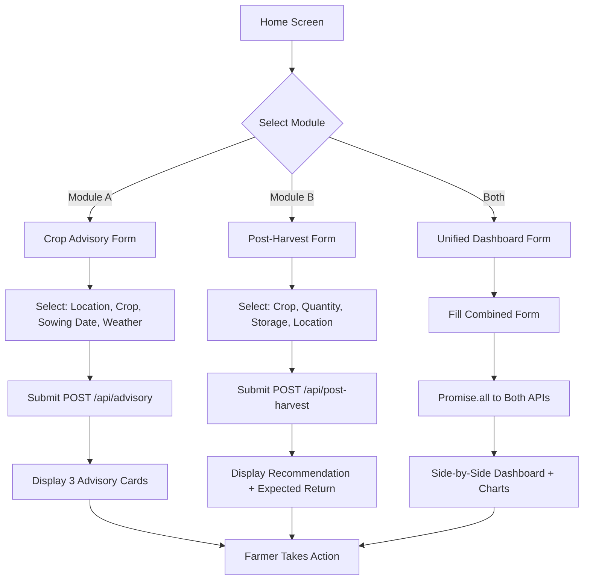
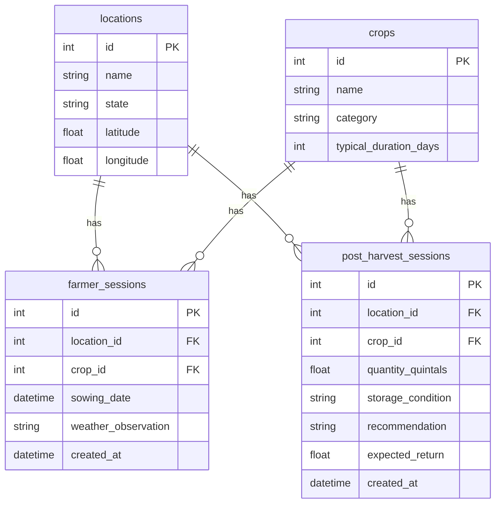

# Software Requirements Specification (SRS)

**Project:** AgriTech - Precision Crop Advisory & Post-Harvest Decision Engine  
**Version:** 1.0  
**Date:** July 2026  
**Team:** TetraTHON 2026  

---

## Table of Contents

1. [Introduction](#1-introduction)
2. [Overall Description](#2-overall-description)
3. [Functional Requirements](#3-functional-requirements)
4. [Non-Functional Requirements](#4-non-functional-requirements)
5. [System Constraints](#5-system-constraints)
6. [External Interfaces](#6-external-interfaces)
7. [Data Requirements](#7-data-requirements)
8. [User Characteristics](#8-user-characteristics)
9. [Assumptions and Dependencies](#9-assumptions-and-dependencies)
10. [Acceptance Criteria](#10-acceptance-criteria)

---

## 1. Introduction

### 1.1 Purpose

This Software Requirements Specification (SRS) describes the functional and non-functional requirements of the AgriTech platform - a dual-engine agricultural decision support system designed to help Indian farmers optimize crop management and post-harvest operations.

### 1.2 Scope

AgriTech is a web-based application that provides:

- **Crop Advisory Module:** Stage-specific irrigation, fertiliser, and pest management advisories based on growth stage calculation, weather conditions, and agronomic rules.
- **Post-Harvest Planner Module:** Financial optimization for selling, storing, or transporting produce by comparing spoilage rates, storage costs, transport expenses, and market prices across multiple APMC markets.

### 1.3 Definitions, Acronyms, and Abbreviations

| Term | Definition |
|------|-----------|
| SRS | Software Requirements Specification |
| SRD | Software Requirements Document |
| APMC | Agricultural Produce Market Committee |
| NPK | Nitrogen, Phosphorus, Potassium |
| API | Application Programming Interface |
| CRUD | Create, Read, Update, Delete |
| ORM | Object-Relational Mapping |
| Haversine | Great-circle distance formula |

### 1.4 References

- TetraTHON 2026 Problem Statement
- OpenWeatherMap API Documentation
- data.gov.in Agmarknet API Documentation
- FastAPI Official Documentation
- SQLAlchemy 2.0 Documentation

---

## 2. Overall Description

### 2.1 Product Perspective

AgriTech is a standalone web application consisting of:

- **Frontend:** Single-page React application with state-based routing
- **Backend:** FastAPI REST API with SQLite database
- **External Integrations:** OpenWeatherMap (weather data), data.gov.in (market prices)

### 2.2 Product Functions

| Module | Primary Function | Output |
|--------|-----------------|--------|
| Crop Advisory | Calculate growth stage, apply weather risk multipliers, rank advisories | 3 prioritized advisories with confidence scores |
| Post-Harvest Planner | Compare sell/store/transport options with financial modeling | Optimal recommendation with expected net return |
| Unified Dashboard | Trigger both modules concurrently, display side-by-side | Combined advisory + financial view with charts |

### 2.3 User Classes

| User Class | Description | Technical Level |
|------------|-------------|-----------------|
| Farmer | Primary end-user seeking crop advice | Low |
| Agricultural Officer | Advisory role, uses system to advise farmers | Medium |
| System Administrator | Manages system configuration and data | High |

### 2.4 Operating Environment

| Component | Requirement |
|-----------|-------------|
| Backend | Python 3.11+, FastAPI, SQLite |
| Frontend | Modern browsers (Chrome, Firefox, Safari, Edge) |
| Hosting | Render (backend), Vercel (frontend) |
| Network | Internet connection for API calls |

---

## 3. Functional Requirements

### 3.1 Crop Advisory Module

#### FR-3.1.1: Growth Stage Calculation

| Attribute | Value |
|-----------|-------|
| **ID** | FR-3.1.1 |
| **Description** | Calculate current growth stage from sowing date |
| **Input** | Sowing date (YYYY-MM-DD) |
| **Process** | `days_since_sowing = today - sowing_date` |
| **Output** | Growth stage name (e.g., "Flowering Boll") |
| **Priority** | Must Have |

#### FR-3.1.2: Irrigation Advisory Generation

| Attribute | Value |
|-----------|-------|
| **ID** | FR-3.1.2 |
| **Description** | Generate irrigation advice based on growth stage and weather |
| **Input** | Growth stage, weather forecast, user observation |
| **Process** | Match stage rules, apply weather adjustments |
| **Output** | Water depth (cm), frequency (days), rain adjustment |
| **Priority** | Must Have |

#### FR-3.1.3: Fertiliser Advisory Generation

| Attribute | Value |
|-----------|-------|
| **ID** | FR-3.1.3 |
| **Description** | Generate NPK fertiliser recommendations |
| **Input** | Growth stage, crop type |
| **Process** | Match stage rules, retrieve NPK values |
| **Output** | NPK dosage (kg/acre), application notes |
| **Priority** | Must Have |

#### FR-3.1.4: Pest Advisory Generation

| Attribute | Value |
|-----------|-------|
| **ID** | FR-3.1.4 |
| **Description** | Generate pest/disease risk assessment |
| **Input** | Growth stage, weather conditions |
| **Process** | Match stage rules, apply weather risk multipliers |
| **Output** | Pest name, risk level (Low/Medium/High), observation advice |
| **Priority** | Must Have |

#### FR-3.1.5: Weather Risk Multiplier

| Attribute | Value |
|-----------|-------|
| **ID** | FR-3.1.5 |
| **Description** | Adjust pest risk based on weather conditions |
| **Input** | Base risk level, weather conditions |
| **Process** | If condition matches `raises_risk_if` array, escalate risk |
| **Output** | Adjusted risk level |
| **Priority** | Must Have |

#### FR-3.1.6: Confidence Scoring

| Attribute | Value |
|-----------|-------|
| **ID** | FR-3.1.6 |
| **Description** | Assign confidence level to each advisory |
| **Input** | Weather data availability, rule match type |
| **Process** | High = exact match + weather data; Medium = fallback; Low = error |
| **Output** | Confidence tag (High/Medium/Low) |
| **Priority** | Should Have |

### 3.2 Post-Harvest Planner Module

#### FR-3.2.1: Spoilage Calculation

| Attribute | Value |
|-----------|-------|
| **ID** | FR-3.2.1 |
| **Description** | Calculate produce value loss over time |
| **Input** | Crop, storage type, days, initial value |
| **Process** | Apply storage-type decay rate × crop sensitivity modifier |
| **Output** | Value remaining, total loss |
| **Priority** | Must Have |

#### FR-3.2.2: Transport Cost Calculation

| Attribute | Value |
|-----------|-------|
| **ID** | FR-3.2.2 |
| **Description** | Calculate transport cost to each market |
| **Input** | Farm coordinates, market coordinates, quantity |
| **Process** | Haversine distance × ₹5/km/quintal (₹500 minimum) |
| **Output** | Transport cost per market |
| **Priority** | Must Have |

#### FR-3.2.3: Market Price Comparison

| Attribute | Value |
|-----------|-------|
| **ID** | FR-3.2.3 |
| **Description** | Compare prices across 5 APMC markets |
| **Input** | Crop, market names |
| **Process** | Load prices from live API or CSV fallback |
| **Output** | Price per quintal per market |
| **Priority** | Must Have |

#### FR-3.2.4: Financial Decision Engine

| Attribute | Value |
|-----------|-------|
| **ID** | FR-3.2.4 |
| **Description** | Compare 3 options and recommend optimal |
| **Input** | Crop, quantity, storage, location |
| **Process** | Calculate net return for sell/store/transport |
| **Output** | Recommendation, expected return, reason |
| **Priority** | Must Have |

### 3.3 Unified Dashboard Module

#### FR-3.3.1: Concurrent Module Execution

| Attribute | Value |
|-----------|-------|
| **ID** | FR-3.3.1 |
| **Description** | Execute both modules simultaneously |
| **Input** | Combined form inputs |
| **Process** | `Promise.all()` concurrent API calls |
| **Output** | Advisory + Post-Harvest results |
| **Priority** | Must Have |

#### FR-3.3.2: Interactive Charts

| Attribute | Value |
|-----------|-------|
| **ID** | FR-3.3.2 |
| **Description** | Display price trends and spoilage curves |
| **Input** | Historical prices, spoilage data |
| **Process** | Render Recharts line charts |
| **Output** | 90-day price trend, 30-day spoilage curve |
| **Priority** | Should Have |

### 3.4 Data Management

#### FR-3.4.1: Session Logging

| Attribute | Value |
|-----------|-------|
| **ID** | FR-3.4.1 |
| **Description** | Log all farmer requests for auditing |
| **Input** | Advisory/Post-Harvest inputs |
| **Process** | Insert into FarmerSession/PostHarvestSession tables |
| **Output** | Session ID |
| **Priority** | Should Have |

#### FR-3.4.2: Database Seeding

| Attribute | Value |
|-----------|-------|
| **ID** | FR-3.4.2 |
| **Description** | Populate database with locations and crops |
| **Input** | JSON seed data |
| **Process** | AUTO_SEED=true on startup |
| **Output** | Populated locations and crops tables |
| **Priority** | Must Have |

---

## 4. Non-Functional Requirements

### 4.1 Performance

| ID | Requirement | Target |
|----|-------------|--------|
| NFR-4.1.1 | API response time | < 2 seconds |
| NFR-4.1.2 | Frontend initial load | < 3 seconds |
| NFR-4.1.3 | Concurrent users | 50+ without degradation |

### 4.2 Reliability

| ID | Requirement | Target |
|----|-------------|--------|
| NFR-4.2.1 | System uptime during demo | 99% |
| NFR-4.2.2 | External API fallback | Graceful degradation to mock data |
| NFR-4.2.3 | Database crash recovery | SQLite ACID compliance |

### 4.3 Usability

| ID | Requirement | Target |
|----|-------------|--------|
| NFR-4.3.1 | Mobile responsive | Works on phones and tablets |
| NFR-4.3.2 | Loading indicators | Spinner on all API calls |
| NFR-4.3.3 | Error messages | Human-readable, actionable |

### 4.4 Security

| ID | Requirement | Target |
|----|-------------|--------|
| NFR-4.4.1 | Rate limiting | 30 requests/minute per endpoint |
| NFR-4.4.2 | CORS | Whitelist allowed origins |
| NFR-4.4.3 | Security headers | X-Content-Type-Options, X-Frame-Options |
| NFR-4.4.4 | Input validation | Pydantic schema validation |

### 4.5 Maintainability

| ID | Requirement | Target |
|----|-------------|--------|
| NFR-4.5.1 | Code style | PEP 8 (Python), ESLint (JSX) |
| NFR-4.5.2 | Test coverage | >80% on engine modules |
| NFR-4.5.3 | Documentation | API docs auto-generated |

---

## 5. System Constraints

| Constraint | Description | Mitigation |
|------------|-------------|------------|
| Timeline | 36-hour hackathon | Sequential chunk execution |
| Budget | Free hosting only | Render free tier, Vercel free tier |
| Network | Intermittent internet | Mock data fallback for all external APIs |
| Data | Limited market data | 1,800-row CSV dataset as baseline |
| Scope | Prototype only | Focus on 4 crops, 5 locations |

---

## 6. External Interfaces

### 6.1 User Interface

| Interface | Description |
|-----------|-------------|
| Home Screen | 3 cards: Unified Dashboard, Crop Advisory, Post-Harvest |
| Advisory Form | Dropdowns: location, crop, sowing date, weather |
| Post-Harvest Form | Dropdowns: crop, quantity, storage, location |
| Results View | Advisory cards or recommendation with charts |

### 6.2 Hardware Interfaces

None - web-based application.

### 6.3 Software Interfaces

| API | Purpose | Fallback |
|-----|---------|----------|
| OpenWeatherMap | 7-day weather forecast | Mock deterministic data |
| data.gov.in (Agmarknet) | Historical market prices | CSV dataset |

### 6.4 Communication Interfaces

| Protocol | Usage |
|----------|-------|
| HTTPS | All API communication |
| REST | Backend API architecture |
| JSON | Request/response format |

---

## 7. Data Requirements

### 7.1 Database Schema

| Table | Purpose | Key Fields |
|-------|---------|------------|
| locations | Farm locations | name, state, latitude, longitude |
| crops | Supported crops | name, category, typical_duration_days |
| farmer_sessions | Advisory request logs | location_id, crop_id, sowing_date |
| post_harvest_sessions | Post-Harvest request logs | location_id, crop_id, quantity, recommendation |

### 7.2 Static Data

| File | Records | Purpose |
|------|---------|---------|
| irrigation_rules.json | 4 crops × 3-4 stages | Irrigation parameters |
| fertiliser_rules.json | 4 crops × 3-4 stages | NPK recommendations |
| pest_rules.json | 4 crops × 3-4 stages | Pest/disease risk rules |
| mandi_prices.csv | 1,800+ rows | Historical market prices |

### 7.3 Data Retention

- Session logs retained indefinitely (SQLite file)
- No user authentication required
- No PII collected

---

## 8. User Characteristics

### 8.1 Farmer (Primary User)

| Attribute | Description |
|-----------|-------------|
| Technical level | Low |
| Device | Mobile phone (primary), desktop |
| Network | Intermittent connectivity |
| Language | English (potential Hindi in future) |
| Goal | Get actionable crop advice quickly |

### 8.2 Agricultural Officer

| Attribute | Description |
|-----------|-------------|
| Technical level | Medium |
| Device | Desktop |
| Network | Reliable connectivity |
| Goal | Advise multiple farmers using system data |

---

## 9. Assumptions and Dependencies

### 9.1 Assumptions

1. Farmers have access to a smartphone with internet
2. Sowing dates provided are accurate
3. Market prices reflect real market conditions
4. Weather forecasts are reasonably accurate (7-day window)

### 9.2 Dependencies

| Dependency | Type | Risk |
|------------|------|------|
| OpenWeatherMap API | External | High - API may be slow or down |
| data.gov.in API | External | High - Government API may be unreliable |
| Render hosting | External | Medium - Free tier has cold starts |
| Vercel hosting | External | Low - Reliable CDN |

---

## 10. Acceptance Criteria

### 10.1 Crop Advisory Module

- [ ] System calculates correct growth stage from sowing date
- [ ] System returns 3 advisories (irrigation, fertiliser, pest)
- [ ] Weather observation affects pest risk level
- [ ] Confidence tags reflect data availability
- [ ] Response time < 2 seconds

### 10.2 Post-Harvest Planner Module

- [ ] System compares at least 3 options (sell, store, transport)
- [ ] Spoilage calculation accounts for storage type
- [ ] Transport cost uses Haversine distance
- [ ] Recommendation includes expected net return
- [ ] Response time < 2 seconds

### 10.3 Unified Dashboard

- [ ] Both modules execute concurrently
- [ ] Results display side-by-side
- [ ] Charts render without errors
- [ ] Response time < 3 seconds

### 10.4 System Quality

- [ ] All external APIs have mock fallbacks
- [ ] Error messages are human-readable
- [ ] UI is mobile responsive
- [ ] No console errors in production

---

*- AgriTech SRS v1.0 -*
